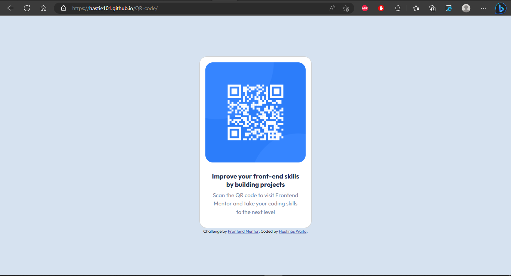

# Frontend Mentor - QR code solution

  

This is a solution to the [QR code component challenge on Frontend Mentor](https://www.frontendmentor.io/challenges/qr-code-component-iux_sIO_H). Frontend Mentor challenges help you improve your coding skills by building realistic projects.

  

## Table of contents

  

- [Overview](#overview)

- [Screenshot](#screenshot)

- [Links](#links)

- [My process](#my-process)

- [Built with](#built-with)

- [What I learned](#what-i-learned)

- [Continued development](#continued-development)

- [Useful resources](#useful-resources)

- [Author](#author)

- [Acknowledgments](#acknowledgments)

  


  

## Overview

  

### Screenshot

  




  
  

Then crop/optimize/edit your image however you like, add it to your project, and update the file path in the image above.


### Links

  

- Solution URL:[hastie101/QR-code: Front-end mentor challenges (github.com)](https://github.com/hastie101/QR-code)

- Live Site URL:[Frontend Mentor | QR code component (hastie101.github.io)](https://hastie101.github.io/QR-code/)

  

## My process

  

### Built with

  

- Semantic HTML5 markup

- CSS custom properties


  

### What I learned

  

Use this section to recap over some of your major learnings while working through this project. Writing these out and providing code samples of areas you want to highlight is a great way to reinforce your own knowledge.

  

To see how you can add code snippets, see below:

  

```html

<div  class="card"  style="">


<div  class="card-body">

<h5  class="card-title">Improve your front-end skills by building projects</h5>

<p  class="card-text">Scan the QR code to visit Frontend Mentor and take your coding skills

to the next level</p>

</div>

</div>

```

```css

.card{

display: flex;

padding: 15px;

border-radius: 20px;

margin: auto ;

margin-bottom: 0;

flex-direction: column;

width: 300px;

}

```


  

If you want more help with writing markdown, we'd recommend checking out [The Markdown Guide](https://www.markdownguide.org/) to learn more.

  

  

### Continued development

  

I'd like to continue further HTML and CSS development as well as integrate Javascript into future projects.

 

  

### Useful resources

  

- [GitHub Pages | Websites for you and your projects, hosted directly from your GitHub repository. Just edit, push, and your changes are live.](https://pages.github.com/) - This helped me to host my project. I really liked this pattern and will use it going forward.

- [StackEdit – In-browser Markdown editor](https://stackedit.io/)- This is an In-browser Markdown editor which helped me when writing this README file. I'd recommend it to anyone still learning this concept and to those who do content writing.


  

## Author

  

- Github - [hastie101 (Hastings) (github.com)](https://github.com/hastie101)

- Frontend Mentor - [Frontend Mentor | Front-end coding challenges using a real-life workflow](https://www.frontendmentor.io/home)

- Twitter - [Hastings Waita (@HastingsWaita) / Twitter](https://twitter.com/HastingsWaita)

  


  

## Acknowledgments

  
I would like to acknowledge the following for their contribution in helping me make this project a success:

 - Samson Aricha - http://www.linkedin.com/in/aricha-samson https://github.com/samAricha
 - Emmanuel Mwaele - https://github.com/mwaele